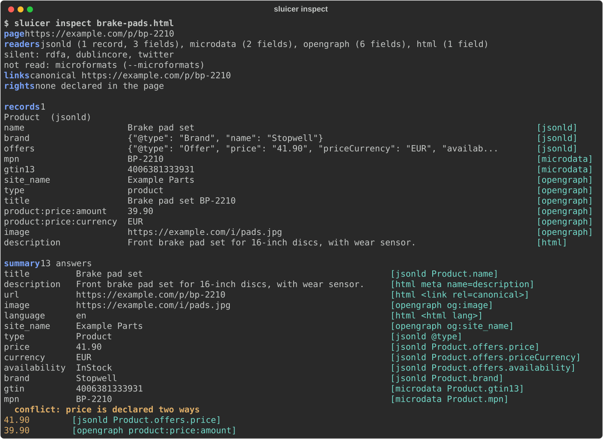

# Getting started

Ten minutes from nothing to reading your own pages: install Sluicer, read a
page, understand what came back, and do the same from Python and from an agent.

## 1. Install

As a command, in an environment of its own:

```bash
uv tool install "sluicer[markdown]"
sluicer --version
```

With pipx instead: `pipx install "sluicer[markdown]"`. As a library, in your
project's environment:

```bash
uv pip install "sluicer[markdown]"
```

With pip instead: `pip install "sluicer[markdown]"`.

The base install reads every page you have on disk and fetches pages from the
web over plain HTTP, with nothing installed but `lxml`, `click`, `cssselect` and `protego`
(and `tomli` on Python 3.10);
the extra adds turning a page into markdown. A page that is an empty shell a
script fills in needs a browser: add the `browser` extra, and install its
Chromium once with `uvx --from "sluicer[browser]" playwright install chromium`.
The [extras](index.md#install) are listed on the home page.

### Shell completion

`sluicer` completes its commands and their options in bash (4.4 or later),
zsh and fish, from a script it prints when `_SLUICER_COMPLETE` names the
shell. Write the script once, then load it from the shell's startup file:

```bash
# bash
_SLUICER_COMPLETE=bash_source sluicer > ~/.sluicer-complete.bash
echo '. ~/.sluicer-complete.bash' >> ~/.bashrc

# zsh (the line goes after compinit in ~/.zshrc)
_SLUICER_COMPLETE=zsh_source sluicer > ~/.sluicer-complete.zsh
echo '. ~/.sluicer-complete.zsh' >> ~/.zshrc

# fish, which reads the completions directory itself
_SLUICER_COMPLETE=fish_source sluicer > ~/.config/fish/completions/sluicer.fish
```

Written to a file, the script costs nothing when a shell starts;
`eval "$(_SLUICER_COMPLETE=zsh_source sluicer)"` in the startup file works as
well, and runs `sluicer` each time. Write it again after upgrading, so a new
command or option completes too. macOS's own `/bin/bash` is 3.2, which the
script does not support; zsh, its default shell, is fine.

## 2. Read a page

Take the example product page from the repository:

```bash
curl -O https://raw.githubusercontent.com/Gi0tto/sluicer/main/examples/brake-pads.html
sluicer inspect brake-pads.html --url https://example.com/p/bp-2210
```

`inspect` prints the reading for a person:



`--url` says where the page came from, so its links resolve; for a page fetched
from the web Sluicer knows that already.

## 3. Understand what came back

`sluicer extract` gives the same reading as JSON, for a program. Its keys:

| key | what it holds |
|---|---|
| `summary` | one answer per question -- `title`, `price`, `author`, `published` and 21 more -- each with where it came from |
| `normalised` | what the summary's dates, prices and currencies mean, when that is certain: ISO 8601, a decimal, an ISO 4217 code |
| `conflicts` | every question the page answers two ways that mean different things |
| `records` | everything the page declared, one record per thing, every field with its source and place; every value is text, a JSON-LD number as the page wrote it (`"41.90"`, not `41.9`) |
| `sources` | the vocabularies that declared something, in the order they are trusted |
| `links`, `rights` | where else the page lives -- canonical, languages, feeds -- and what it says about how it may be used |

Every answer says where it came from in the same three parts. Here is the
summary's price:

```json
{
  "value": "41.90",
  "source": "jsonld",
  "key": "Product.offers.price",
  "where": "/html/head/script[1]#/offers/price"
}
```

`source` is the vocabulary that declared it, `key` what was read, and `where`
the place on the page: an XPath to the element, and inside a JSON-LD block a
JSON pointer to the very value. A meta tag has no place finer than its name,
so its `where` is `null` and its `key` says which tag it was.

The page declares its price twice, and not the same way, so `conflicts` says so
rather than choosing silently:

```json
[
  {
    "question": "price",
    "answers": [
      {"value": "41.90", "source": "jsonld", "key": "Product.offers.price",
       "where": "/html/head/script[1]#/offers/price"},
      {"value": "39.90", "source": "opengraph", "key": "product:price:amount",
       "where": null}
    ]
  }
]
```

The summary's answer comes first. Sluicer never decides which of the two is
true: the page contradicts itself, and whoever reads it should say so.

## 4. Read a page on the web

```bash
sluicer inspect https://gi0tto.github.io/sluicer/demo/article.html
sluicer markdown https://gi0tto.github.io/sluicer/demo/article.html   # the readable content
sluicer extract https://example.com/ --at 2024-01   # as the Wayback Machine saw it
```

The article belongs to a small made-up site this documentation publishes for
trying Sluicer on; the same pages are in the repository's `examples/site/`.

Sluicer asks with plain HTTP first, under its own name, `Sluicer/<version>`,
after reading the site's robots.txt, and climbs to a browser only when the
answer it got was a refusal (401, 403, 407 or 429), a challenge page, or an
empty shell a script fills in. Every climb is reported with its reason, and a
site that needed the browser once is asked of it first for its next pages. A
site that says no in its robots.txt gets no request at all: the command exits
2 and says why.

To keep the page itself, as the ladder brought it back, for `compile` or any
other command to read later:

```bash
sluicer fetch https://gi0tto.github.io/sluicer/demo/article.html -o article.html
```

A page behind a login takes the site's own cookie or token, sent to that site
and to no other it redirects to; Sluicer's name is never replaced:

```bash
sluicer extract https://example.com/account --cookie session=abc123
sluicer fetch https://api.example.com/items -H "Authorization: Bearer $TOKEN"
```

## 5. From Python

```python
>>> import sluicer
>>> page = open("examples/brake-pads.html", "rb").read()
>>> result = sluicer.extract(page, url="https://example.com/p/bp-2210")
>>> result.summary["title"].value
'Brake pad set'
>>> result.sources
['jsonld', 'microdata', 'opengraph', 'html']
>>> product = result.records[0]
>>> product.type, product.fields["mpn"].value, product.fields["mpn"].source
('Product', 'BP-2210', 'microdata')
>>> product.fields["mpn"].where
'/html/body/div[1]/span[1]'
>>> result.conflicts[0].question
'price'
```

Pass bytes when you have them, as here: the page's own charset is then read
from them. `sluicer.to_markdown(page)` gives the readable content, and
`sluicer.fetch.fetch(url)` the page itself with what fetching it cost. Every
public function is in the [Python reference](reference/python.md).

### From a coroutine

`sluicer.aextract` and `sluicer.fetch.afetch` take what `extract` and `fetch`
take and give what they give, awaited, with the event loop left free while a
page is fetched or parsed:

```python
import asyncio

import sluicer
from sluicer.fetch import afetch


async def titles(urls):
    pages = await asyncio.gather(*(afetch(url) for url in urls))
    results = await asyncio.gather(
        *(sluicer.aextract(p.html, url=p.url, headers=p.headers) for p in pages)
    )
    return [r.summary["title"].value for r in results if "title" in r.summary]
```

Each runs its sync twin on a worker thread of the loop's default executor, so
nothing about fetching changes: the same ladder, the same limits, the same
exceptions. Nor does politeness. Fetches of one site, from any number of
coroutines, threads or crawls in the process, still go one at a time, a
second after the last one ended, and read robots.txt once; `gather` over
fifty pages of one site takes fifty seconds, and over fifty sites about one.
Coroutines waiting for one site wait on the loop and take a worker thread
only when their turn comes, so a slow site never holds the executor's
threads from the others. A coroutine cancelled while it waits asks nothing;
one cancelled after its request went stops waiting, and the request ends on
its thread.

## 6. When a page declares nothing

Some pages carry no structured data at all: a category page of plain HTML, a
shop that never added schema.org. Two ways in, both without a model:

```bash
sluicer extract listing.html --induce              # the rows the markup repeats
sluicer compile p1.html p2.html -o shop.json --want price=41.90 --want title="Brake pads"
sluicer run shop.json https://shop.example/c?p=7   # replay it, checked on every page
```

`--induce` reads the rows a page repeats and marks every field it found that
way `source="induced"`. `compile --want` learns where the values you name live,
from pages of one template, and writes an extractor that checks every page it
reads: a page whose layout changed exits 3 instead of returning nulls.
[Extractors](extractors.md) tells the whole story, `heal` included.

## 7. Give it to your agent

```bash
claude mcp add sluicer -- uvx --with "sluicer[mcp]" sluicer mcp    # Claude Code
codex mcp add sluicer -- uvx --with "sluicer[mcp]" sluicer mcp     # Codex
```

The agent then has twelve tools, every one of which only reads. Cursor, VS Code,
Gemini CLI, Claude Desktop, Zed and the agent frameworks are in
[In your agent](agents.md); each tool and its parameters are in the
[MCP reference](reference/mcp.md).

## Where next

- [Extractors](extractors.md): learn, replay and heal an extractor for a site.
- [Crawling](crawling.md): a site's map, a crawl of its links, a list of pages.
- [Audit](audit.md): a page's markup against what Google documents.
- [Command line](reference/cli.md): every command and every option.
- [Known limits](known-limits.md): what Sluicer does not do, measured.
